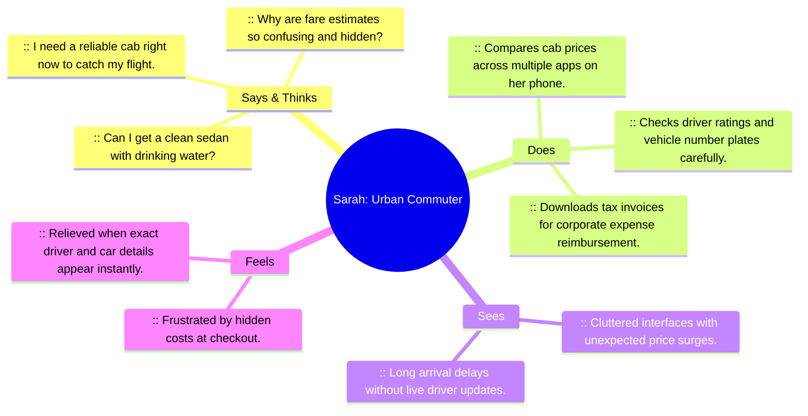
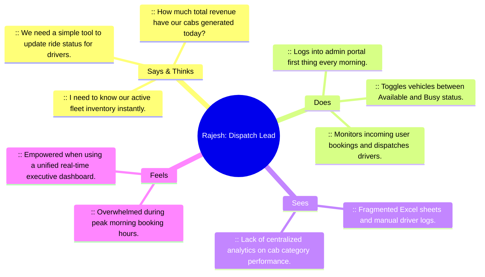

# Phase 1: Brainstorming & Ideation — User Empathy Maps

**Project Name:** Cab Booking (`UCab`)  
**Project ID:** `N/A (Solo Track Submission)`  
**Developer Role:** Solo Full-Stack MERN Developer  

---

## 1. Overview of Empathy Mapping
To design a user-centric cab booking platform, empathy maps were constructed for two primary stakeholders: the **Urban Commuter (Sarah)** who books rides daily, and the **Fleet Dispatch Manager (Rajesh)** who oversees cab operations and trip dispatches.

---

## 2. Persona 1: Urban Commuter (Sarah, 29 - Marketing Manager)

### Empathy Breakdown Table — Sarah (Rider)

| Quadrant | Key Observations & Insights | How UCab Addresses This |
| :--- | :--- | :--- |
| **SAYS** | "I want to know the exact fare breakdown before confirming my booking." | **Transparent Pricing:** Displays base fare (`₹50`), per-KM rate (`₹12/km`), and live promo discounts (`UCAB20`). |
| **THINKS** | "Is my cab actually coming, and who is driving?" | **Live Dispatch Tracker:** Shows real-time progress bar with assigned driver credentials (`Vikram Sharma - 4.9 ★`). |
| **DOES** | Frequently travels with luggage after office hours and prefers extra comfort. | **In-Ride Customization:** Allows pre-ordering chilled mineral water and snacks (`+₹50`). |
| **FEELS** | Stressed about getting receipts for company tax claims. | **Instant Corporate Receipts:** One-click PDF thermal invoice download with QR verification code. |

---

## 3. Persona 2: Fleet Dispatch Manager (Rajesh, 45 - Operations Lead)

### Empathy Breakdown Table — Rajesh (Admin)

| Quadrant | Key Observations & Insights | How UCab Addresses This |
| :--- | :--- | :--- |
| **SAYS** | "We need one clean screen showing revenue, total rides, and active cars." | **Analytics KPI Bar:** Real-time top-level summary cards displaying Gross Revenue (`₹`), Total Bookings, and Active Users. |
| **THINKS** | "Can I quickly add a new vehicle when our fleet expands?" | **Complete Fleet CRUD:** Intuitive `AddCar.jsx` and `EditCar.jsx` forms with image upload and instant status toggling. |
| **DOES** | Manages dispatch by updating ride states from pending to started. | **Trip Control Monitor:** Centralized `AdminBookings.jsx` where any ride status can be updated with 1 click. |
| **FEELS** | Worried about database server crashes bringing down dispatch operations. | **Zero-Config Storage Engine:** Automatically falls back to `data.json` if database services disconnect, ensuring zero downtime. |
