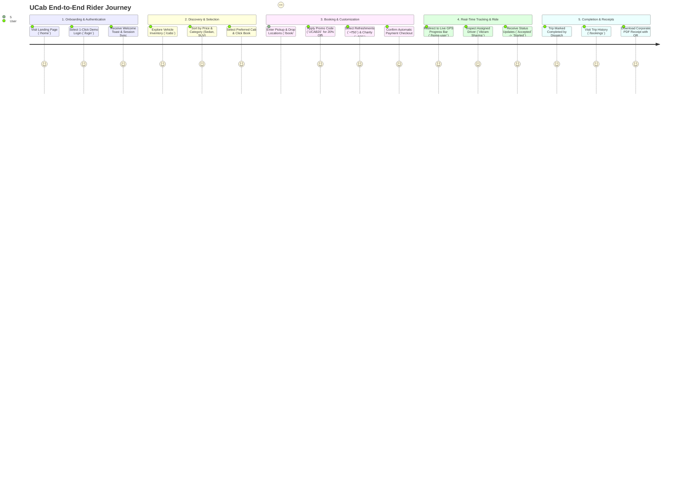

# Phase 2: Requirement Analysis — Customer Journey Map

**Project Name:** Cab Booking (`UCab`)  
**Project ID:** `N/A (Solo Track Submission)`  
**Developer Role:** Solo Full-Stack MERN Developer  

---

## 1. End-to-End Rider Journey Map
The customer journey map details the step-by-step experience of a rider using **UCab**, from initial discovery to ride completion and receipt generation.

---

## 2. Touchpoint & Opportunity Analysis Table

| Journey Stage | User Goal | Touchpoint / Component | Potential Pain Points | UCab Engineering Solution |
| :--- | :--- | :--- | :--- | :--- |
| **1. Onboarding** | Quick, frictionless login without typing lengthy credentials. | `Login.jsx` & `AuthContext.jsx` | Forgotten passwords or slow email verification during demos. | **1-Click Demo Login:** Instantly injects pre-seeded credentials (`pravanshu@ucab.com`) and issues JWT session. |
| **2. Discovery** | Compare prices and vehicle capacities across categories. | `CabListing.jsx` | Overwhelming vehicle lists without clear pricing distinctions. | **Filter & Sort Engine:** Interactive category tabs (`Mini`, `Sedan`, `SUV`, `Luxury`) and sort by `₹/km`. |
| **3. Booking** | Customize trip fare and request extra travel comforts. | `BookCab.jsx` | Hidden fees or lack of transparency on distance calculation. | **Real-Time Fare Breakdown:** Live distance calculation with instant promo code subtraction and toggleable perks. |
| **4. Tracking** | Know where the driver is and when the cab will arrive. | `UserHome.jsx` | Uncertainty about whether the trip was accepted or dispatched. | **Live Dispatch Status Bar:** Visual 4-stage tracking indicator with driver contact number and vehicle plate. |
| **5. Post-Ride** | Obtain verified receipts for corporate tax expense filing. | `MyBookings.jsx` & `ReceiptModal.jsx` | Clunky email invoicing or missing tax breakdown details. | **Corporate QR Invoice Modal:** One-click printable thermal receipt with embedded verification QR code. |
