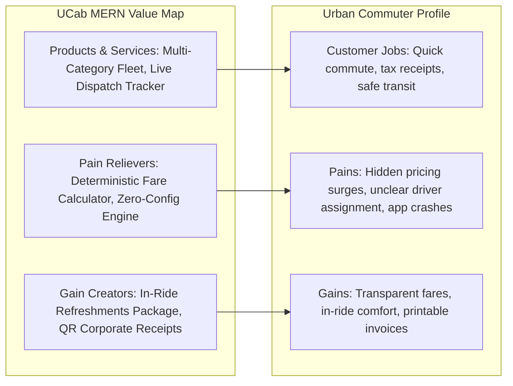

# Phase 3: Project Design Phase — Problem-Solution Fit & Value Proposition

**Project Name:** Cab Booking (`UCab`)  
**Project ID:** `N/A (Solo Track Submission)`  
**Team Member / Solo Developer:** Shaik Sumiya Zainab  

---

## 1. Value Proposition Canvas Overview
To ensure complete Problem-Solution Fit, **UCab** was structured around the exact customer jobs, pains, and gains identified during Phase 1 research. Every technical feature built into the application directly resolves a specific friction point for urban commuters and fleet dispatchers.

---

## 2. Problem-Solution Alignment Matrix

| Identified Customer / Admin Pain Point | UCab Value Proposition & Feature Solution | Technical Mechanism |
| :--- | :--- | :--- |
| **Opaque, fluctuating cab fares with hidden surge charges.** | **Deterministic & Transparent Pricing Engine:** Users see explicit base fares and exact per-km rates for every cab class before booking. | Real-time calculation formula inside `BookCab.jsx` and `bookingController.js`. |
| **Impersonal travel experience with no hospitality options.** | **In-Ride Customization & Charity Suite:** Commuters can pre-order chilled water & snacks (`+₹50`) or donate to driver healthcare (`+₹20`). | State-driven checkout add-on checkboxes stored directly in `Booking` schema. |
| **Uncertainty about driver dispatch and vehicle arrival.** | **Interactive Live Dispatch Status Bar:** Visual step-by-step progress tracking with exact driver name (`Vikram Sharma`) and plate number. | Dynamic state mapping (`Pending` → `Accepted` → `Started` → `Completed`) in `UserHome.jsx`. |
| **Difficulty generating verified receipts for company tax claims.** | **Instant Corporate Thermal Invoice Modal:** One-click PDF receipt generation complete with an embedded verification QR code. | `ReceiptModal.jsx` utilizing clean table formatting and dynamically generated QR strings. |
| **Database installation crashes during university/presentation grading.** | **Zero-Config Dual Database Storage Engine:** Guarantees 100% demo uptime whether MongoDB is online or offline. | Automatic detection and atomic fallback (`server/db/store.js`) saving to `data.json`. |
