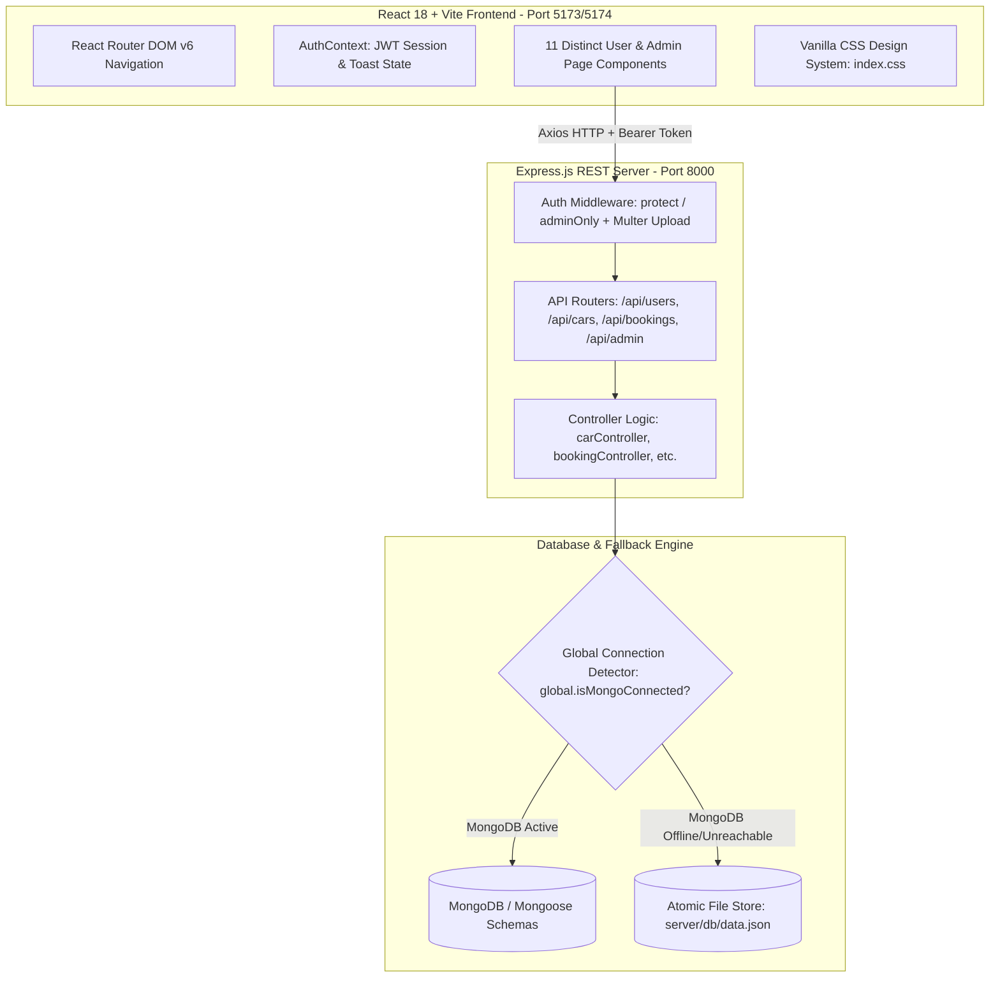

# Phase 3: Project Design Phase — Detailed Solution Architecture Specification

**Project Name:** Cab Booking (`UCab`)  
**Project ID:** `N/A (Solo Track Submission)`  
**Team Member / Solo Developer:** Shaik Sumiya Zainab  

---

## 1. Multi-Layer System Architecture Diagram
The technical architecture of **UCab** is divided into three distinct decoupled layers: the Presentation Layer (React + Vite), the REST API Application Layer (Express + Node.js), and the Dual-Engine Persistence Layer (`MongoDB` / `JSON Store`).



---

## 2. Component Hierarchy & Data Flow (Frontend)
The React frontend is architected as a clean hierarchical tree where global state (`user session`, `token`, and `toast notifications`) is managed via `AuthContext.jsx` and injected across all route components:

```text
App.jsx (Root Router & Theme Container)
├── AuthContext.Provider (Global JWT State Manager)
│   ├── Navbar.jsx (Dynamic Navigation & Role Badges)
│   ├── Toast.jsx (Floating Notification Alert Box)
│   ├── Public Routes:
│   │   ├── Home.jsx (Hero Section + Instant Booking Widget)
│   │   ├── CabListing.jsx (Filterable Fleet & Category Tabs)
│   │   ├── Login.jsx / Register.jsx (Rider Authentication + 1-Click Demo)
│   │   └── AdminLogin.jsx / AdminRegister.jsx (Executive Authentication)
│   ├── Protected User Routes (`ProtectedUserRoute.jsx`):
│   │   ├── BookCab.jsx (Checkout, Distance Estimator & Perks Suite)
│   │   ├── UserHome.jsx (Live GPS Tracking Progress Bar)
│   │   ├── MyBookings.jsx (Trip Log + `ReceiptModal.jsx` Invoice Generator)
│   │   └── Profile.jsx (User Details & Saved Payment Settings)
│   └── Protected Admin Routes (`ProtectedAdminRoute.jsx`):
│       ├── AdminHome.jsx (Analytics KPI Dashboard & Revenue Summary)
│       ├── AdminCars.jsx (Fleet Inventory Control)
│       ├── AddCar.jsx / EditCar.jsx (Fleet CRUD Forms + Image Uploads)
│       ├── AdminBookings.jsx (System-Wide Trip Dispatch Control)
│       └── AdminUsers.jsx (Registered Rider Directory)
└── Footer.jsx (Copyright & Quick Links)
```

---

## 3. Database Schema Definitions (`Mongoose ODM`)

### 3.1 User Schema (`server/models/User.js`)
```javascript
const userSchema = new mongoose.Schema({
    name: { type: String, required: true },
    email: { type: String, required: true, unique: true },
    password: { type: String, required: true }, // Bcrypt Hashed
    phone: { type: String, default: "+91 98765 43210" },
    savedPaymentMethod: { type: String, default: "Automatic Saved Card (Visa •••• 4242)" },
    profileImage: { type: String, default: "https://images.unsplash.com/photo-1535713875002-d1d0cf377fde?auto=format&fit=crop&w=200&q=80" }
}, { timestamps: true });
```

### 3.2 Car Schema (`server/models/Car.js`)
```javascript
const carSchema = new mongoose.Schema({
    name: { type: String, required: true },
    cabType: { type: String, required: true, enum: ['Mini', 'Sedan', 'SUV', 'Luxury'] },
    pricePerKm: { type: Number, required: true },
    baseFare: { type: Number, required: true },
    seats: { type: Number, required: true },
    plateNumber: { type: String, required: true, unique: true },
    image: { type: String, required: true },
    isAvailable: { type: Boolean, default: true }
}, { timestamps: true });
```

### 3.3 Booking Schema (`server/models/Booking.js`)
```javascript
const bookingSchema = new mongoose.Schema({
    user: { type: mongoose.Schema.Types.ObjectId, ref: 'User', required: true },
    car: { type: mongoose.Schema.Types.ObjectId, ref: 'Car', required: true },
    pickupLocation: { type: String, required: true },
    dropLocation: { type: String, required: true },
    bookingDate: { type: String, required: true },
    distanceKm: { type: Number, required: true },
    totalFare: { type: Number, required: true },
    status: { type: String, enum: ['Pending', 'Accepted', 'Started', 'Completed', 'Cancelled'], default: 'Accepted' },
    refreshmentsOrdered: { type: Boolean, default: false },
    donationMade: { type: Boolean, default: false },
    discountCode: { type: String, default: null },
    discountAmount: { type: Number, default: 0 },
    driverAssigned: {
        name: { type: String, default: "Vikram Sharma" },
        phone: { type: String, default: "+91 98111 22334" },
        rating: { type: String, default: "4.9 ★" }
    }
}, { timestamps: true });
```
