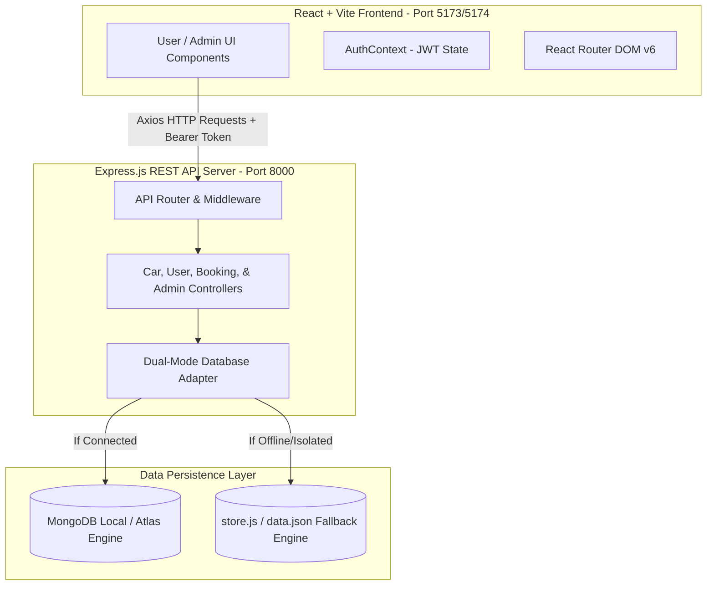

# Phase 3: System Design & Architecture

## 1. High-Level Architecture Diagram (MERN Stack)

---

## 2. Entity-Relationship Data Models (Mongoose Schemas)

### 2.1 User Schema (`User.js`)
* `name`: String (Required)
* `email`: String (Required, Unique)
* `password`: String (Hashed with Bcrypt)
* `phone`: String (Default phone formatting)
* `savedPaymentMethod`: String (e.g. `Automatic Saved Card (Visa •••• 4242)`)
* `profileImage`: String (URL)

### 2.2 Car Schema (`Car.js`)
* `name`: String (Required, e.g. `Maruti Suzuki Swift Dzire`)
* `cabType`: String (`Mini` | `Sedan` | `SUV` | `Luxury`)
* `pricePerKm`: Number (in ₹)
* `baseFare`: Number (in ₹)
* `seats`: Number (4 to 6)
* `plateNumber`: String (Unique Registration Plate)
* `image`: String (URL)
* `isAvailable`: Boolean (Default: true)

### 2.3 Booking Schema (`Booking.js`)
* `user`: ObjectId (References `User`)
* `car`: ObjectId (References `Car`)
* `pickupLocation`: String
* `dropLocation`: String
* `bookingDate`: String
* `distanceKm`: Number
* `totalFare`: Number
* `status`: String (`Pending` | `Accepted` | `Started` | `Completed` | `Cancelled`)
* `refreshmentsOrdered`: Boolean
* `donationMade`: Boolean
* `discountCode`: String
* `discountAmount`: Number
* `driverAssigned`: Object (`name`, `phone`, `rating`)

---

## 3. Core API Specification

| HTTP Method | Route Endpoint | Description | Access Level |
| :--- | :--- | :--- | :--- |
| **POST** | `/api/users/login` | Authenticate user & issue JWT token | Public |
| **POST** | `/api/users/register` | Register new rider account | Public |
| **GET** | `/api/cars` | Fetch filtered & sorted fleet inventory | Public |
| **POST** | `/api/bookings` | Create new cab booking trip | Protected User |
| **GET** | `/api/bookings/user` | Get all personal trips for logged-in rider | Protected User |
| **POST** | `/api/admin/login` | Authenticate executive dispatcher | Public |
| **GET** | `/api/admin/stats` | Fetch KPI metrics & revenue summary | Protected Admin |
| **PUT** | `/api/bookings/:id` | Update ride status (`Started`, `Completed`, etc.) | Protected Admin |
