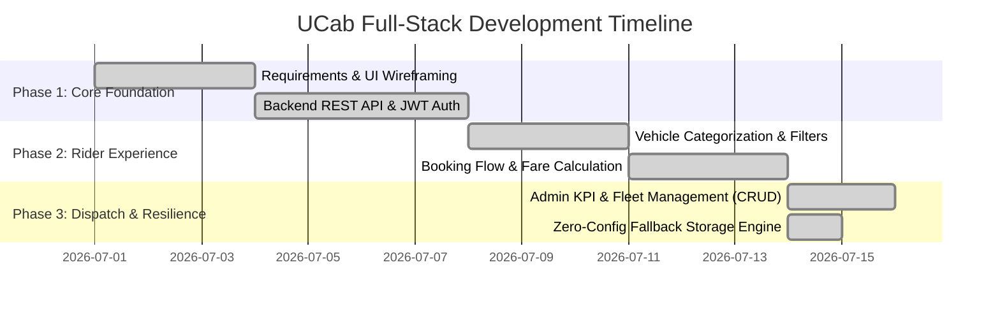

# Phase 4: Project Planning & Development Roadmap

## 1. Project Milestones & Sprints

---

## 2. Work Breakdown Structure (WBS)

### 2.1 Frontend Engineering (React + Vite)
* **Design System (`index.css`):** Glassmorphism cards, CSS variables, vibrant status colors, and responsive grid patterns.
* **Core Components:** `Navbar.jsx`, `Footer.jsx`, `ProtectedUserRoute.jsx`, `ProtectedAdminRoute.jsx`, and `ReceiptModal.jsx`.
* **State Management (`AuthContext.jsx`):** Persistent JWT handling in `localStorage` alongside floating toast notification triggers.

### 2.2 Backend Engineering (Node.js + Express.js)
* **Security Layer (`authMiddleware.js`):** Intercept and decode Bearer tokens for both User and Admin routes.
* **Controllers:** `carController.js`, `userController.js`, `bookingController.js`, and `adminController.js`.
* **Resilience Engine (`config.js` & `store.js`):** Automatic local JSON storage system that guarantees application availability even if the local MongoDB daemon is stopped.
