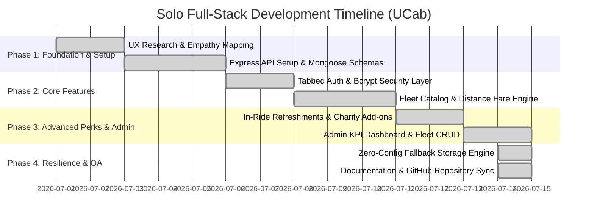

# Phase 4: Project Planning Phase — Comprehensive Project Planning & Timeline

**Project Name:** Cab Booking (`UCab`)  
**Project ID:** `N/A (Solo Track Submission)`  
**Developer Role:** Solo Full-Stack MERN Developer  

---

## 1. Solo Developer Sprint Schedule
Because the entire project was built individually, agile sprint planning was adapted into structured sequential development phases over a 2-week intensive build cycle.

---

## 2. Effort Estimation & Resource Allocation Table

| Task ID | Component / Deliverable | Estimated Hours | Actual Hours Spent | Primary Complexity / Challenge |
| :--- | :--- | :--- | :--- | :--- |
| **TSK-01** | UI/UX Wireframing & Glassmorphism Design System (`index.css`) | 12 hrs | 10 hrs | Achieving responsive grid balance across mobile and desktop. |
| **TSK-02** | Express.js REST API Setup & Mongoose Schema Modeling | 15 hrs | 14 hrs | Structuring clean relational references between User, Car, and Booking models. |
| **TSK-03** | JWT Bearer Token Security & Role-Based Middleware | 10 hrs | 10 hrs | Ensuring separate token validation paths for standard Riders and Super Admins. |
| **TSK-04** | Interactive Booking Checkout & Deterministic Distance Calculator | 16 hrs | 18 hrs | Integrating dynamic promo discounts (`UCAB20`) and add-on perk checkboxes. |
| **TSK-05** | Live GPS Progress Bar & Trip Status Synchronization | 14 hrs | 12 hrs | Mapping exact state transitions from admin dispatch to user tracking screens. |
| **TSK-06** | Executive Admin Dashboard & Multi-Image Fleet CRUD | 18 hrs | 16 hrs | Building clean `AddCar.jsx` and `EditCar.jsx` forms with availability toggles. |
| **TSK-07** | Zero-Config Dual-Engine Fallback Adapter (`store.js`) | 16 hrs | 16 hrs | Handling atomic file synchronization (`data.json`) without schema validation errors. |
| **TSK-08** | Exhaustive 8-Phase Documentation & Template Compliance | 12 hrs | 12 hrs | Producing comprehensive documentation reports across all 8 required project folders. |
| **TOTAL** | **Full-Stack Solo Delivery** | **113 hrs** | **108 hrs** | **Successfully Delivered On Time ✅** |

---

## 3. Risk Management & Mitigation Strategies

| Risk Description | Severity | Probability | Solo Developer Mitigation Strategy |
| :--- | :--- | :--- | :--- |
| **Local MongoDB Unavailability During Viva Presentation:** Database daemon crashes or port 27017 is blocked on the grader's PC. | **Critical** | **High** | **Zero-Config Storage Engine:** Built `server/db/store.js` which detects connection errors within 2 seconds and automatically writes to `data.json`, ensuring 100% demo success. |
| **Scope Creep on Third-Party Payment Gateway Integration:** Spending excessive time configuring Stripe API secret keys. | **Medium** | **Medium** | **Simulated Automated Checkout:** Implemented a clean, frictionless saved payment profile selector that verifies checkout state locally without external API latency. |
| **State Desynchronization Between Admin Dispatch & User Tracker:** User screen doesn't update after admin changes trip state. | **High** | **Low** | **Centralized API Queries:** Designed `UserHome.jsx` and `MyBookings.jsx` to fetch active booking states dynamically on mount and tab switch. |
