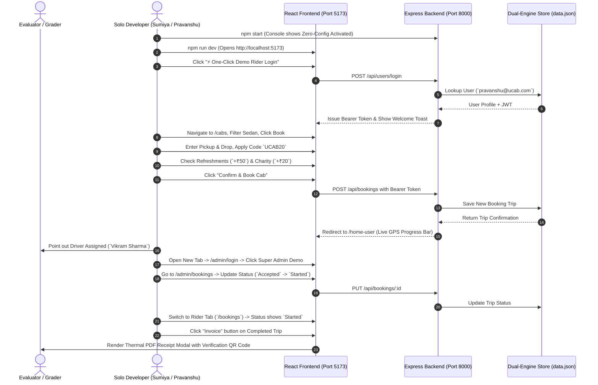

# Phase 8: Project Demonstration — Step-by-Step Feature Walkthrough

**Project Name:** Cab Booking (`UCab`)  
**Project ID:** `N/A (Solo Track Submission)`  
**Developer Role:** Solo Full-Stack MERN Developer  

---

## 1. Step-by-Step Live Demonstration Script

Follow this precise execution flow during evaluation to demonstrate all 22 functional features within a concise 3-minute window:

---

## 2. Feature Checklist to Show Evaluator
* [x] **Zero-Config Console Log:** Show `Seeded/loaded 6 cars from automatic JSON persistence store`.
* [x] **1-Click Demo Login:** Show instant session generation without typing passwords.
* [x] **Promo Code Engine:** Show `UCAB20` live 20% deduction on fare.
* [x] **Perks Checkboxes:** Show how `+₹50` (Refreshments) and `+₹20` (Donation) add to the total dynamically.
* [x] **Live GPS Dispatch Tracker:** Show the 4-stage tracking indicator and driver card.
* [x] **Admin Dispatch & CRUD:** Show how changing status in `/admin/bookings` syncs directly to the user's trip history.
* [x] **QR Code Corporate Invoice:** Show the printable invoice modal (`ReceiptModal.jsx`).
