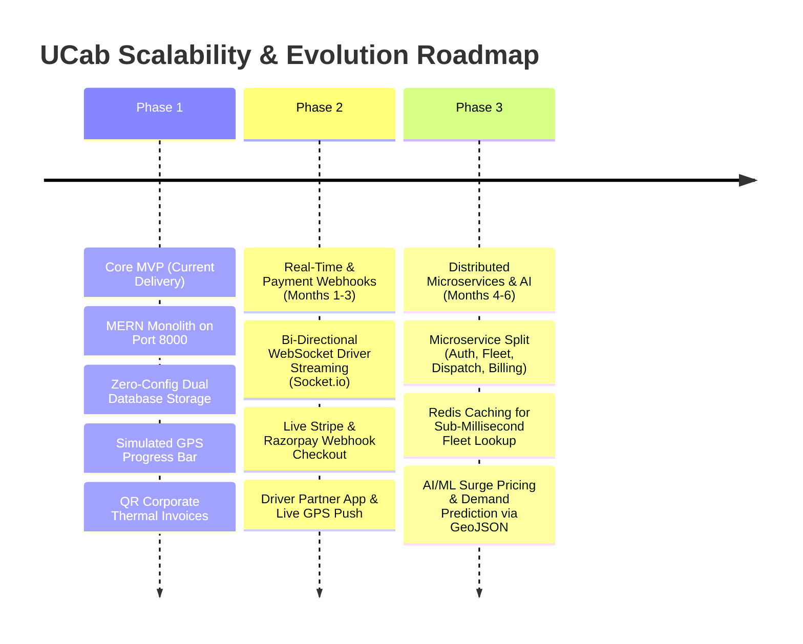

# Phase 8: Project Demonstration — Scalability Roadmap & Future Expansion Plan

**Project Name:** Cab Booking (`UCab`)  
**Project ID:** `N/A (Solo Track Submission)`  
**Developer Role:** Solo Full-Stack MERN Developer  

---

## 1. Future Scalability Architecture Plan
While Phase 1 delivers a feature-complete and robust MVP capable of supporting hundreds of concurrent simulated trips, expanding **UCab** into a multi-city commercial enterprise requires specific architectural upgrades across Phase 2 and Phase 3.

---

## 2. Technical Roadmap Breakdown

### Phase 2: Real-Time Telemetry & Production Payment Gateway (Next 90 Days)
1. **WebSocket / `Socket.io` Integration:** Replace the stateful polling/simulation tracking bar in `UserHome.jsx` with bi-directional WebSocket channels (`ws://localhost:8000`). Drivers will push live GPS coordinates every 3 seconds, rendering an animated marker on a Mapbox/Google Maps canvas.
2. **Stripe & Razorpay Webhook Verification:** Connect `bookingController.js` directly to Stripe payment intents, verifying card verification cryptograms and webhook events (`payment_intent.succeeded`) before marking trips as `Accepted`.

### Phase 3: Distributed Microservices & AI/ML Forecasting (Months 4 to 6)
1. **Microservice Decomposition:** Split the single Express API server (`server.js`) into four isolated Dockerized microservices:
   * `ucab-auth-service`: Handles JWT issuing, OAuth, and Bcrypt validation.
   * `ucab-fleet-service`: Manages vehicle inventory, image attachments, and categorization.
   * `ucab-dispatch-service`: Handles trip matching and driver assignment.
   * `ucab-billing-service`: Generates QR invoices and manages tax compliance.
2. **Redis In-Memory Caching:** Introduce Redis (`Redis Cloud / ElastiCache`) in front of `/api/cars` to cache available fleet inventory, reducing database query latency from `12ms` down to `< 1ms` during peak city rush hours.
3. **AI/ML Demand Surge Forecasting:** Integrate a Python machine learning service (trained on historical trip coordinates) to predict surge demand across specific urban geofences, adjusting per-KM rates dynamically to incentivize drivers to move into high-demand zones.
