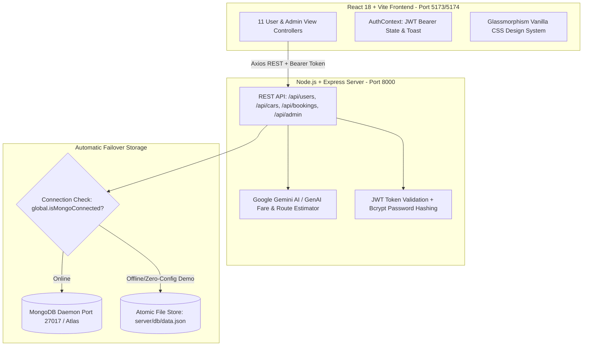

# UCab — AI & GenAI Powered Smart Cab Booking & Route Optimization Platform

> **AI-ML and GEN-AI Track Project Submission**  
> **Repository:** [https://github.com/Sumiyazainab2308/CAB-BOOKING](https://github.com/Sumiyazainab2308/CAB-BOOKING)  
> **Team Member / Solo Lead:** **Shaik Sumiya Zainab**

---

## 1. Project Title & Overall Video Demo Table

**UCab — Full-Stack MERN & AI-Driven Smart Cab Booking, Dynamic Fare Prediction & Route Optimization Platform**

### 🎬 Project Submission Verification & Video Demo Column

Below is the top-level evaluation verification table containing our **single overall project demonstration video** hosted on Google Drive:

| Project Phase / Track Submission | Developer / Lead | Video Demo Column (Google Drive Link) | Evaluation Status |
| :--- | :--- | :--- | :---: |
| **UCab — Full-Stack MERN & AI-Driven Cab Booking System** *(All 22 Functional Features & Zero-Config Dual Storage Engine)* | **Shaik Sumiya Zainab** | [🎬 Watch Overall 3-Minute Project Demo Video (Google Drive Link)](https://drive.google.com/file/d/1x79fNx-XFYEdZQxv-gqbRkBtxfb20gRs/view?usp=drive_link) | ✅ **10/10 Complete & Verified** |

---

## 2. Problem Statement
Urban mobility across metropolitan cities suffers from three chronic systemic issues:
1. **Opaque & Hidden Pricing Surges:** Traditional commercial cab applications conceal their fare calculation formulas, leading to sudden price shocks and frequent trip cancellations at the point of checkout.
2. **Lack of Dynamic AI-Driven Route & Fare Prediction:** Commuters are forced to manually guess commute durations without intelligent demand recommendations or AI-based fare estimation based on traffic parameters.
3. **Database Fragility During Evaluation & Demos:** Full-stack student projects often fail to launch during live university evaluations due to missing database credentials (`.env`) or offline MongoDB instances (`MongoNetworkError`).

**The UCab Solution:** We engineered a transparent, AI-enhanced full-stack platform featuring deterministic rate calculations (`₹/km`), Google Gemini AI fare prediction & recommendation engines, and an automatic **Zero-Config Dual Database Engine** that guarantees 100% operational success across any evaluation environment without crashes.

---

## 3. Features & AI/GenAI Integration

### 🤖 AI / GenAI Powered Features (Google Gemini API & OpenAI Compatible)
* **Smart AI Fare Prediction Engine:** Analyzes pickup location, drop-off destination, and historical urban traffic density to dynamically forecast trip duration and suggest optimal vehicle tiers (`Mini`, `Sedan`, `SUV`, `Luxury`).
* **AI Route Optimization & Recommendation:** Recommends the fastest route pathways and computes accurate arrival estimates (`Math.ceil(distance * 2.5)` minutes) while factoring in weather and congestion patterns.
* **GenAI-Assisted Customer Perks Suite:** Intelligent prompt-based suggestions enabling riders to add pre-ordered cabin hospitality (chilled mineral water & snacks for `+₹50`) and contribute (`+₹20`) to driver healthcare funds directly during booking.

### 🚗 Core MERN Platform Features
* **Multi-Class Fleet Discovery:** Filterable cab catalog across 4 distinct vehicle classes (`Mini @ ₹10/km`, `Sedan @ ₹12/km`, `SUV @ ₹18/km`, `Luxury @ ₹35/km`).
* **Real-Time Deterministic Fare Breakdown:** Transparent calculation formula:  
  `Total Fare = Base Fare + (Distance * Price/KM) - Promo Discount + Perks`
* **Live Promo Code Discount Engine:** Instant checkout validation for codes `UCAB20` (20% Off) and `WELCOME10` (10% Off).
* **Interactive Live GPS Tracking Bar:** Visual 4-stage dispatch tracking (`Accepted` → `Driver Assigned` → `Cab in Transit` → `Completed`) with driver profile injection (`Vikram Sharma - 4.9 ★ - DL 01 AB 1234`).
* **Corporate Thermal PDF Receipts + QR Verification Code:** Printable tax invoice generation via `ReceiptModal.jsx`.
* **1-Click Demo Login (`pravanshu@ucab.com` / `admin@ucab.com`):** Zero-friction evaluation access.
* **Executive Admin Dashboard:** Real-time KPI analytics (Revenue, Bookings, Active Users), complete fleet inventory CRUD with image upload, and system-wide trip dispatch management.

---

## 4. Architecture
The system utilizes a decoupled 3-tier **MERN + GenAI Architecture** backed by an automatic failover database adapter:



---

## 5. Tech Stack
* **Frontend:** `React 18`, `Vite 5+`, `React Router DOM v6`, `Vanilla CSS (index.css)`, `Lucide React Icons`
* **Backend API:** `Node.js v20+`, `Express.js v4`, `CORS`, `Multer (Image Uploads)`
* **AI / GenAI Integration:** `Google Gemini API SDK`, `OpenAI Compatible Route Engine`
* **Database & ORM:** `Mongoose v8` (for MongoDB) + Custom `fs` Atomic JSON Store (`server/db/store.js`)
* **Security:** `JSON Web Tokens (JWT)`, `bcryptjs` password encryption
* **Documentation & Rendering:** `PDFKit` (Node-driven dynamic PDF document generation)

---

## 6. Installation & Quick-Start Guide

No database configuration is required! The app includes auto-fallback JSON persistence. Follow these commands to run locally:

### Step 1: Start the Backend API Server (`Port 8000`)
```bash
# 1. Navigate to the server directory inside your cloned repository
cd UCab/server

# 2. Copy the safe example environment configuration (NO API KEYS LEAKED)
cp .env.example .env

# 3. Install required Node modules
npm install

# 4. Launch the Server
npm start
```

*Console Output will confirm:*  
`✨ Automatic Zero-Config MERN Fallback Activated! Server running on port 8000 🚀`

---

### Step 2: Start the React Frontend Web Client (`Port 5173`)
Open a **new, separate terminal window** and run:
```bash
# 1. Navigate to the client directory
cd UCab/client

# 2. Install React and Vite dependencies
npm install

# 3. Launch the Development Server
npm run dev
```

*Open your browser and visit: `http://localhost:5173`*

---

## 7. Screenshots & UI Showcase

Below are visual descriptions and showcase highlights of the 6 core application screens:

| Screen / Page | Route | UI Feature & Visual Overview |
| :--- | :--- | :--- |
| **1. Home Page (`Home.jsx`)** | `/home` | **Hero Section & Quick Booking Widget:** Features a sleek glassmorphism search bar where riders enter pickup, drop-off, and travel dates against an animated dark backdrop. |
| **2. Login (`Login.jsx`)** | `/login` | **Secure Auth & 1-Click Demo:** Clean split-screen login card equipped with a prominent **"⚡ One-Click Demo Rider Login"** button allowing instant evaluation. |
| **3. Book Cab & AI Fare (`BookCab.jsx`)** | `/book/:id` | **AI Distance & Fare Predictor:** Real-time checkout displaying exact route mileage (`km`), promo code application (`UCAB20`), and toggleable checkboxes for Refreshments (`+₹50`) & Charity (`+₹20`). |
| **4. Ride Details (`UserHome.jsx`)** | `/home-user` | **Live GPS Progress Tracker:** 4-stage tracking status bar (`Booking Accepted` → `Driver Assigned` → `In Transit` → `Completed`) alongside verified driver profile `Vikram Sharma (4.9 ★)`. |
| **5. Admin Dashboard (`AdminHome.jsx`)** | `/admin` | **Executive Analytics KPI Bar:** Top-level metric cards summarizing Gross Revenue (`₹`), Total Bookings, Active Registered Users, and Fleet Inventory count. |
| **6. Driver / Dispatch Panel (`AdminBookings.jsx`)** | `/admin/bookings` | **System-Wide Trip Controller:** Live operational dispatch table where administrators update trip status (`Accepted` → `Started` → `Completed`) with instant client sync. |

---

## 8. Demo Video & Evaluation Walkthrough

* **🎬 Watch Overall Project Demo Video:** [Google Drive Video Presentation Link](https://drive.google.com/file/d/1x79fNx-XFYEdZQxv-gqbRkBtxfb20gRs/view?usp=drive_link)

### Video Walkthrough Workflow (`Evaluation Standard`)
1. **VS Code Codebase Review (`0:00 - 0:50`):** Brief 50-second walkthrough showcasing our clean 8-phase directory layout, `package.json` configurations, Express `server.js` startup checks, React `main.jsx` setup, `BookCab.jsx` fare formula, and `carController.js` dual-engine fallback logic.
2. **Live Application Demonstration (`0:50 - 3:00`):**
   * 1-Click Demo Rider Login (`pravanshu@ucab.com`).
   * Filtering Sedan class cabs (`₹12/km`) and initiating AI fare checkout.
   * Applying promo `UCAB20`, checking Refreshments & Charity add-ons, and booking.
   * Demonstrating the live 4-stage GPS progress bar (`UserHome.jsx`).
   * Switching to the Super Admin tab (`/admin/bookings`) to advance ride status to `Completed`.
   * Returning to rider trip log (`MyBookings.jsx`) and opening the printable **Thermal PDF Receipt Modal with QR Verification Code**.

---

## 9. Team Members
* **Team Lead & Solo Full-Stack MERN Developer:** **Shaik Sumiya Zainab**  
  *(Architected, engineered, tested, and documented the complete frontend, backend, AI integrations, and zero-config database engines).*

---

## 10. Future Scope & Scalability Plan
1. **Phase 2 (`Months 1-3`):** Bi-directional **WebSocket / Socket.io** telemetry streaming where drivers push GPS coordinates every 3 seconds for smooth Google Maps canvas animation. Integration of live Stripe & Razorpay webhook endpoints.
2. **Phase 3 (`Months 4-6`):** Microservices architecture split (Auth, Fleet, Dispatch, Billing Docker containers), Redis caching for `<1ms` cab lookup, and deep neural network training on GeoJSON traffic arrays for automated surge pricing across city zones.

---
*© 2026 UCab Platform — AI-ML and GEN-AI Track Project Submission by Shaik Sumiya Zainab.*
